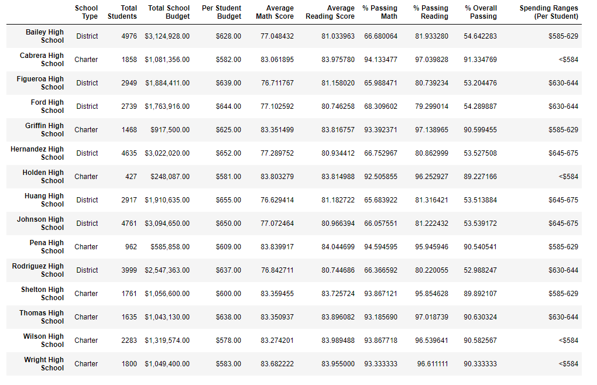

# School District Analysis
4 Panda, Jupyter and Python

## School District Analysis Overview
I have been working with Maria on created various data elements concerned with district-wide statistics and the impact of budget, school type and number of students per school affect testing results.  Maria and her supervisor were recently notified by the school board that the students_complete.csv file shows evidence of academic dishonesty; specifically, reading and math grades for Thomas High School ninth graders appear to have been altered. Although the school board does not know the full extent of the academic dishonesty, they want to uphold state-testing standards and have turned to Maria for help. She has asked me to replace the math and reading scores for Thomas High School with NaNs while keeping the rest of the data intact. After that is completed, Maria requested that I recalculate the data for the school district analysis report back the impact.

## School District Analysis
There are seven key metrics being calculated and some were impacted by the change in math and reading scores but some were not, here are my findings:
### 1. Total School Budget - this metric would not be impacted by a change in math or reading scores as they are not part of the calculation.
### 2. Per Student Budget - as with Total School Budget, Per Student Bedget metric would not be impacted by a change in math and reading scores.
### 3. Average Math Score - the change in average math score after the 9th grade data was set to NaN and all the calculations adjustments were made was very small for Thomas High School; the original % was 83.418349 and changed to 83.350937, which is a -.08% change.  This is less than signifigant once the numbers are rounded to the 1 decimal place.
### 4. Average Reading Score - similar to the match average, the change in average reading score after the 9th grade data was set to NaN and all the calculations adjustments were made, was very small for Thomas High School; the original % was 83.848930 and changed to 83.896082, which is a +.05% increase.  This is less than signifigant once the numbers are rounded to the 1 decimal place.
### 5. % Passing Math - as with the Average Math and Reading Scores, the % Passing Math only changed by an insignifigant amount. The original calulation of 93.272171 changed to  93.185690 which is a decrease of .09 %, as expecte from previous metric changes.
### 6. % Passing Reading amount showed the largest change of a decrease of .30 % as the numbers went from 97.308869 to 97.018739. While the biggest difference, while still a small amount, both math and reading % passing both went down.
### 7. % Overall Passing - because both the % Passing Math and Reading both went down, we would expect to see the cumulative effect on the Overall Passing, which we do. The Thomas High School, % Overall Passing went from 90.948012 to 90.630324 which is an overall change of - .34 %. Again, because the % Passing Reading had a .30 % drop we would see it reflected here. 

## School District Analysis Summary
If we look at the differnce between the Original Spending Summary dataframe and the Challenge Spending Summary dataframe (attached below), we can see there were 5 changes to the school distict analysis in the category that Thomas High School was grouped into due to their school's spending range of $630 to $644.  The other ranges would not have been affected by the changes to Thomas High School, as as expected, there are not changes in the other ranges.

### For the range of $630 to $644 that Thomas school was in we see the following changes BEFORE we format the dataframe:
- Average Math Score went from the original output of 78.518855 to the challenge output of 78.502002. This would be due to the decrease in math scores at Thomas High School once the corrupt data was removed and calculation adjusted.
- Average Reading Score went up for this range from original of 81.624473 to challenge percentage of 81.636261. Again, this would be expected given the results of reading increased slightly when 9th graders were removed.
- % Passing Math went down from 73.484209 to 73.462589, this is impacted by the internal change at Thomas High School for this metric.
- % Passing Reading 84.391793 84.319261 this is impacted by the internal change at Thomas High School for this metric as even though the Average Reading Score went up, % passing would not necessarily have the same increase.
- % Overall Passing - this metric changed from 62.857656 on the original to  62.778233 on the challenge with updated numbers includes.  We would expect this to reflect the changes in % Passing Math and % Passing Reading, and we do see a decrease similar in that to the sum of those figures.
				

### For the range of $630 to $644 that Thomas school was in we see the following changes AFTER we format the date:
All of the above differences no longer have any detectable impact after rounding, as shown in the two illustrations: 

## Resources
- Data Source: election_resulrs.csv
- Software: Python 3.6.1, Visusal Studio Code, 1.38.1

## Election-Audit Summary
This Python script was written to provide easy access to election results with-out needing to use excel which can be
more time consuming to run the process and to re-use available code.

Here are some possible additional uses for the module with somewhat easy modifications:
1) If the input .csv has additional columns or is not in the same order, it would be easy to modify the code to accept a different
.csv columnns.
2) If the election_results.csv could be modified to include if the ballots were either:
    - mail in
    - punchcard or machine counted
    - DRE computer counted cards
   Analysis could be completed to see which methods are used most often and even which counties utilize which methods the most.
3) It could be easily modified for primaries by using if and elif statements to get several of the candidates who received the top 
votes based on requirements of how many candidates are eligible to run.xx

# Challenge Overview
Was difficult and time comsuming to do the assignment but the challenge was a bit easier as I had everything in place from the assignment.
